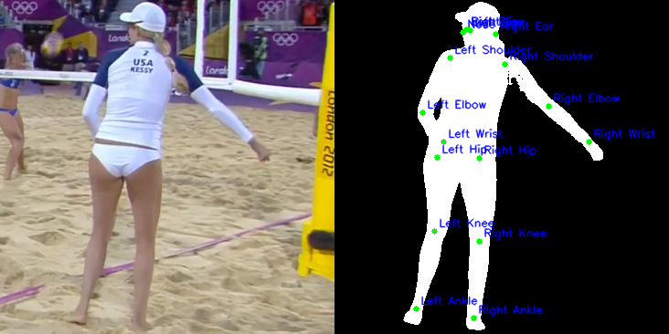

# Silhouette Processing and Keypoint Visualization Script

## Overview
This Python script processes silhouette images by cropping them based on bounding box information and visualizing keypoints. It is designed to work with human pose estimation datasets.

## Features
- Crop silhouette images based on predefined bounding boxes
- Update keypoint coordinates to match cropped image
- Visualize keypoints on cropped silhouettes
- Side-by-side visualization of original and cropped images with keypoints

## Requirements
- Python 3.7+
- NumPy
- OpenCV (cv2)
- tqdm

## Installation
```bash
pip install numpy opencv-python tqdm
```

## Usage
```bash
python silhouette_processor.py \
    --silh_dir /path/to/silhouettes \
    --crop_silh_dir /path/to/cropped/silhouettes \
    --img_dir /path/to/original/images \
    --annotation_file /path/to/annotations.npz \
    --visualization_dir /path/to/visualizations
```

### Arguments
- `--silh_dir`: Directory containing original silhouette images
- `--crop_silh_dir`: Directory to save cropped silhouettes
- `--img_dir`: Directory containing original images
- `--annotation_file`: Path to NumPy annotation file
- `--visualization_dir`: Directory to save visualization images

## Annotation File Format
The script expects a NumPy `.npz` file with the following keys:
- `fnames`: Filenames of images
- `joints2D`: 2D keypoint coordinates
- `bbox_centres`: Bounding box centers
- `bbox_whs`: Bounding box width and height

## Keypoints
The script supports 17 keypoints:
1. Nose
2. Left Eye
3. Right Eye
4. Left Ear
5. Right Ear
6. Left Shoulder
7. Right Shoulder
8. Left Elbow
9. Right Elbow
10. Left Wrist
11. Right Wrist
12. Left Hip
13. Right Hip
14. Left Knee
15. Right Knee
16. Left Ankle
17. Right Ankle

## Output
- Cropped silhouette images
- Updated annotation file with cropped keypoint coordinates
- Visualization images with original and cropped images side by side


## Visualization Details
- Green dots represent keypoints
- Blue text labels indicate keypoint names
- Only keypoints with confidence > 0.0 are displayed