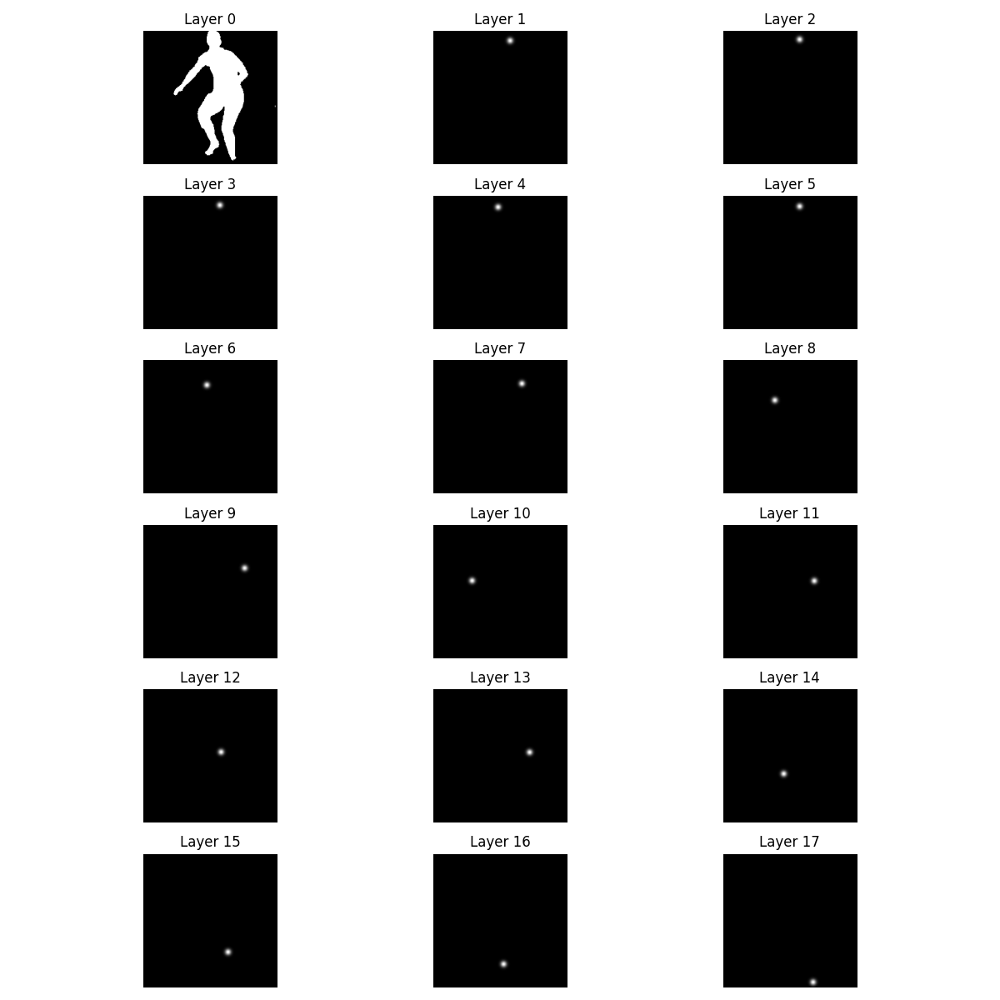

# Proxy Representation Generation

This Python script processes silhouette images and 2D keypoints to generate proxy representations, which combine normalized silhouettes and Gaussian heatmaps for keypoints. These representations are saved in `.npy` format and can be visualized layer-by-layer.

## Features
1. **Data Processing**
   - Resizes binary silhouettes to a fixed resolution of `(256, 256)`.
   - Scales 2D keypoints to match the resized silhouette dimensions.
   - Converts keypoints into Gaussian heatmaps.
   - Combines the resized silhouette and heatmaps into a proxy representation of shape `(18, 256, 256)`.

2. **Visualization**
   - Allows visualization of individual layers in the proxy representation.
   - Saves visualizations as `.png` files for inspection.

---

## Requirements

Install the following Python packages:

- numpy
- opencv-python
- matplotlib

You can install them using pip:
```bash
pip install numpy opencv-python matplotlib
```

---

## Usage

### File Structure
Ensure the following directory structure:

```
/path/to/dataset/
|-- croppedSilhouettes/    # Directory containing silhouette images
|-- labels.npz             # File containing filenames and 2D keypoints
```

### Script Setup
Update the following paths in the script:
- `SILH_DIR`: Path to the `croppedSilhouettes` directory.
- `LABEL_PATH`: Path to the `labels.npz` file.
- `OUTPUT_PATH`: Path where the generated proxy representations will be saved.
- `VISUALIZATION_DIR`: Path where visualizations will be saved.

### Running the Script

1. **Generate Proxy Representations**

Run the script to generate and save proxy representations:
```bash
python script_name.py
```

2. **Visualize Proxy Representations**

To visualize and save the layers of a specific proxy representation, call:
```python
visualize_proxy_representation(index)
```
Replace `index` with the desired representation index.

Example:
```bash
python script_name.py
# Visualizes the first proxy representation
```

---

## Outputs

1. **Proxy Representations**
   - Saved as a `.npy` file at the specified `OUTPUT_PATH`.
   - Shape: `(311, 18, 256, 256)` (assuming 311 data points).

2. **Visualizations**
   - Saved as `.png` files in the `VISUALIZATION_DIR`.
   - Each file represents all 18 layers of a proxy representation.

---

## Example

### Proxy Representation Structure
- **Layer 0**: Resized binary silhouette.
- **Layers 1-17**: Gaussian heatmaps of the 17 2D keypoints.

### Visualization Example
Each visualization `.png` contains:
- 18 subplots, one for each layer.
- Each subplot shows the grayscale representation of a layer.

---

## Notes
- Ensure that all silhouette images are square before resizing.
- Keypoints must align with the silhouette dimensions.